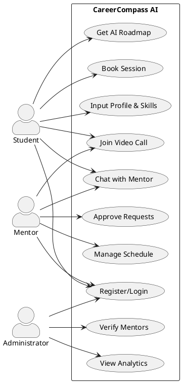

# CareerCompass AI - Use Case Diagram

## Mermaid Flowchart (Works in GitHub/VS Code)

```mermaid
flowchart LR
    subgraph Actors
        S[👤 Student]
        M[👨‍🏫 Mentor]
        A[👨‍💼 Administrator]
    end

    subgraph CareerCompass["🧭 CareerCompass AI System"]
        UC1([Register/Login])
        UC2([Input Profile & Skills])
        UC3([Get AI Career Roadmap])
        UC4([Book Mentorship Session])
        UC5([Join Video Call])
        UC6([Chat with Mentor])
        UC7([Manage Schedule])
        UC8([Approve Session Requests])
        UC9([Verify Mentors])
        UC10([View Analytics Dashboard])
    end

    S --> UC1
    S --> UC2
    S --> UC3
    S --> UC4
    S --> UC5
    S --> UC6

    M --> UC1
    M --> UC7
    M --> UC8
    M --> UC5
    M --> UC6

    A --> UC1
    A --> UC9
    A --> UC10
```

---

## PlantUML Syntax (Use with PlantUML extension or online server)

---

## Notes

- **Mermaid** doesn't have native use case diagram support, so we use a flowchart with `([text])` for oval shapes (use cases)
- **PlantUML** has proper use case diagram syntax - use [PlantUML extension](https://marketplace.visualstudio.com/items?itemName=jebbs.plantuml) or [PlantUML Online Server](https://www.plantuml.com/plantuml/uml/)
- To preview Mermaid in VS Code, use the **Markdown Preview Enhanced** extension or view on GitHub
